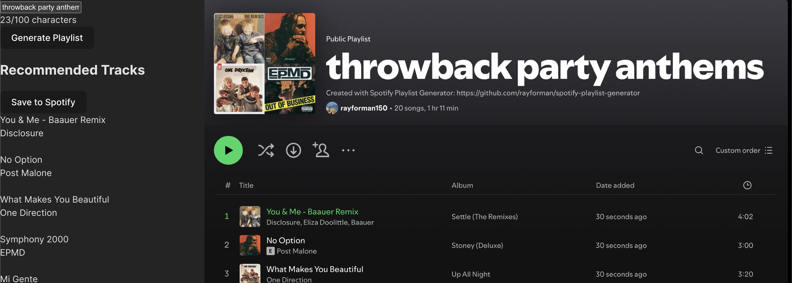

# Spotify AI Playlist Generator

## Overview
A web application that generates personalized Spotify playlists using GPT-3.5 to analyze text descriptions and map them to Spotify's audio features. The app combines OpenAI's language understanding with Spotify's recommendation system to create playlists that match users' descriptions.

## Current Features
- Text-to-playlist generation using GPT-3.5
- Smart mapping of natural language to Spotify's 11 audio features
- Context-aware genre selection
- OAuth authentication with Spotify
- Playlist saving to Spotify account
- Extreme-value audio feature mapping for distinctive playlists

## IMPORTANT UPDATE 
Due to Spotify's recent changes to their Web API, this application is temporarily disfunctional. Critical API functions such as getRecommendations() have been removed from public access. I have applied for extended API access to recover functionality and am awaiting approval. Thank you for your patience. 
[More info](https://developer.spotify.com/blog/2024-11-27-changes-to-the-web-api?utm_source=chatgpt.com)

## Screenshots



## Upcoming Features
- Artist recognition in input text for better seed selection 
- Fuzzy matching for artist names
- Multiple seed types (artists, tracks, genres)
- Preview tracks before saving
- Fine-tuned recommendation constraints
- Custom playlist artwork
- Enhanced error handling and user feedback
- Advanced audio feature interpolation

## Installation
1. Clone repository:
```bash
git clone https://github.com/yourusername/spotify-playlist-generator.git
```

2. Install dependencies:
```bash
# Server
cd server
npm install

# Client
cd ../client
npm install

# NLP Service
cd ../nlp-service
python -m venv venv
source venv/bin/activate  # Windows: venv\Scripts\activate
pip install -r requirements.txt
```

## Configuration
Create three .env files:

1. `server/.env`:
```
SPOTIFY_CLIENT_ID=your_spotify_id
SPOTIFY_CLIENT_SECRET=your_spotify_secret
REDIRECT_URI=http://localhost:5001/auth/callback
```

2. `nlp-service/.env`:
```
OPENAI_API_KEY=your_openai_key
```

## Running the Application
1. Start all services:
```bash
# Terminal 1 - Server
cd server
npm start

# Terminal 2 - Client
cd client
npm run dev

# Terminal 3 - NLP Service
cd nlp-service
source venv/bin/activate
python app.py
```

2. Visit http://localhost:5173

## Project Structure
```
.
├── client/                          # React frontend
│   ├── src/
│   │   ├── components/             # React components
│   │   │   ├── Login.jsx          # Spotify OAuth login
│   │   │   ├── PlaylistDisplay.jsx # Displays generated playlists
│   │   │   └── PlaylistGenerator.jsx # Main input/generation UI
│   │   ├── services/              # API interaction
│   │   │   └── trackRecommendations.js # Spotify API calls
│   │   ├── App.jsx                # Root component
│   │   └── main.jsx               # Entry point
│   └── package.json               # Frontend dependencies
│
├── server/                         # Node.js backend
│   ├── routes/                    # Express routes
│   │   ├── auth.js               # Spotify OAuth handling
│   │   └── spotify.js            # Playlist/recommendation endpoints
│   ├── config.js                  # Environment configuration
│   ├── server.js                  # Express server setup
│   └── package.json               # Backend dependencies
│
└── nlp-service/                    # Python GPT service
   ├── app.py                     # Flask server
   ├── constants.py               # Prompts and configurations
   ├── requirements.txt           # Python dependencies
   └── .env                       # OpenAI API key
```

## Technical Stack
- Frontend: React/Vite
- Backend: Node.js/Express
- NLP: Python/Flask, OpenAI GPT-3.5
- APIs: Spotify Web API, OpenAI API

## License
MIT License
